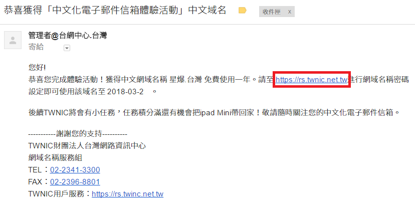
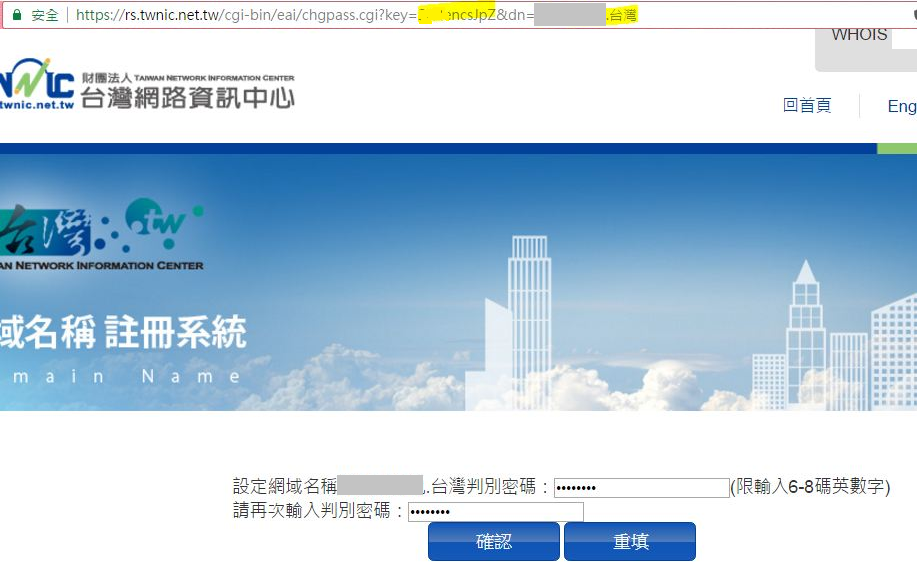
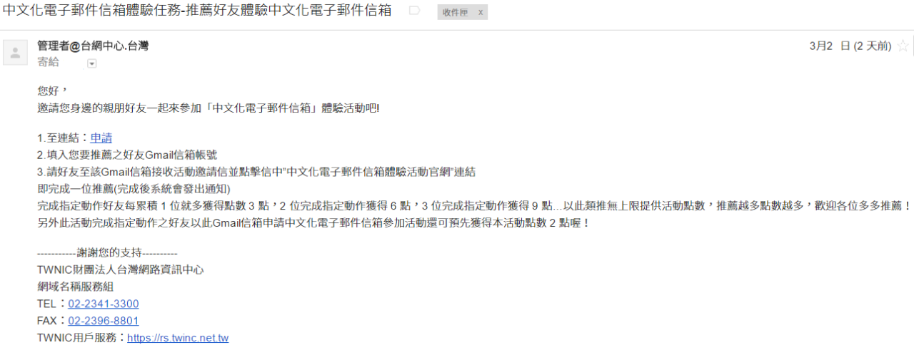
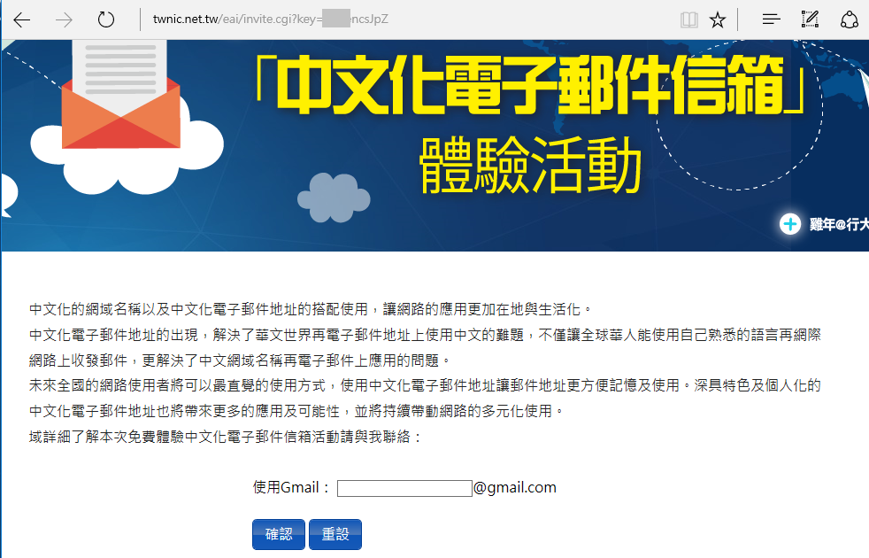
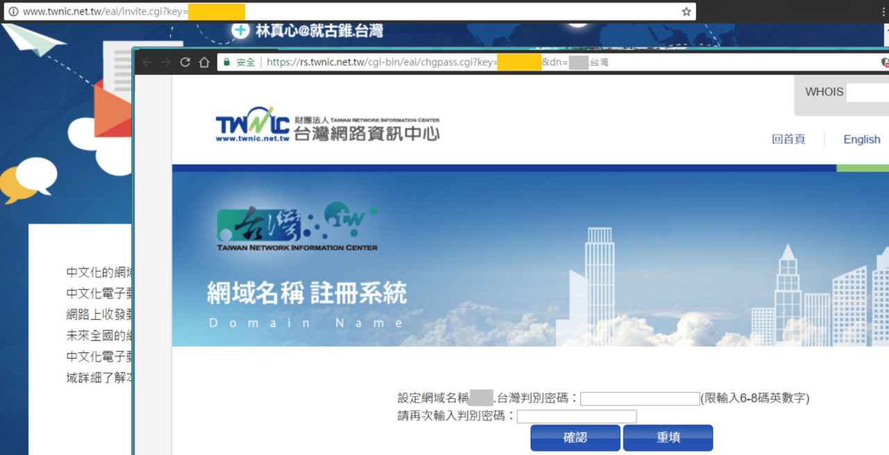
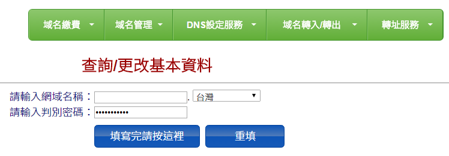
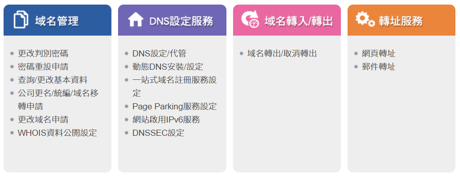
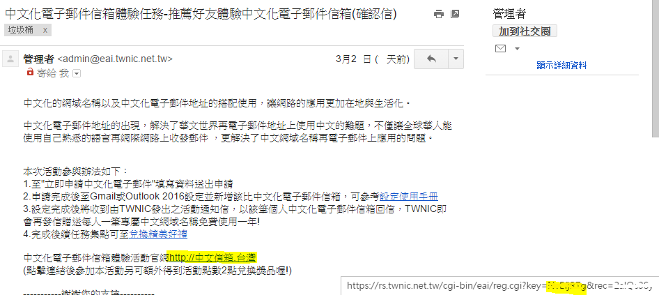
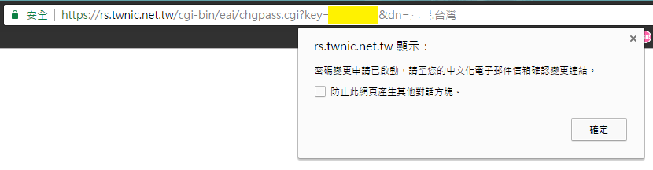
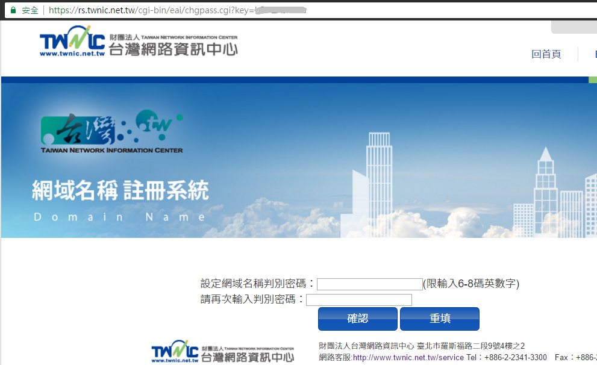

某天逛 Facebook 突然發現有個「中文化電子郵件信箱體驗活動」，只要動動手指就可以體驗看起來很狂的中文信箱地址，而且還附贈該中文網域名稱一年，就趕緊就來申請囉。

在經過很多步驟和教學後，終於拿到了成功獲得域名通知信，信中給了個連結可以設定管理網域的判別密碼。

可以看到設定判別密碼的網址帶了兩個參數 key 及 dn，key 是一串亂碼，而 dn 則是個人中文網域名稱 (灰色方塊部分)。

->透過此網址可重複修改密碼

接著就收到一封邀請好友的信件，點擊信中連結輸入好友 Gmail 信箱，成功推廣可以有抽獎點數。

但點進去推廣頁面，看了網址所帶的參數覺得怎麼有種似曾相識的感覺？

推廣頁面和設定密碼的頁面所使用的 key 竟然是同一把！

如果任何人知道你的中文網域名稱及邀請頁面連結，代入 `KEY` 及 `網域名稱` 到設定密碼頁面，即可修改他人的判別密碼。

https://rs.twnic.net.tw/cgi-bin/eai/chgpass.cgi?key= {KEY} &dn= {網域名稱}.台灣

用修改後的密碼登入就可以取得原域名擁有者的所有權限，可以更改 DNS 設定、查看或修改個人資料等等。

如果你公布了你的網域名稱，順便附上信中的推廣連結，等於是告訴人：來吧，可以幫我改密碼喔。

為了避免關鍵 key 外流，我推廣好友自己打 Gmail 信箱總安全了吧，這樣想就大錯特錯了！

就算自己打信箱推廣，被推廣好友所收到確認信所含連結也有那把可以重設密碼的 key (右下黃色區塊)。總之，如果要推廣好友，絕對不能把我的網域名稱告訴他人，不然他就能幫忙改密碼並接管自己的個人網域了。

->同一人所發出邀請 key 皆相同，參數 rec 不同被推廣者皆不相同。

之後把情況詳情回報給台灣網路資訊中心，當天幾小時後重設密碼的頁面就自動跳轉到 https://rs.twnic.net.tw/cgi-bin/eai/chgpass.cgi 乾淨的網址，改成用 Form Data 的形式送出 key & dn，暫時先改變資料送出的形式，把漏洞變得比較不明顯。

幸好隔天重設密碼的流程就換了，改成只回傳一個\<script\> alert，提示至信箱確認變更密碼連結，他人就不再能簡單取得個人網域權限了，當天的修改貌似只是不想讓更多人能一眼就發現並使用這個漏洞。

設定密碼的頁面所使用的 key (灰色部分) 終於不是那組連推廣都共用的那把了。

查了一下此活動開始也有一段時間了，不過看起來還沒有人發現。為了避免更多資料外洩，當天即送出了問題回報，他們也非常快速的解決了問題，在隔天即修復完成。除了讓人佩服工程師的努力外，正面面對漏洞修補的態度也值得讚賞。

這個問題的根本原因就是重設密碼所用的 token 也被其他服務所使用，而該推廣中文域名活動的服務剛好會讓 token 流出給第三者，而讓外人可以輕易取得域名管理權限。

其實只要多留意並不難發現這個漏洞，但它還是存在了幾個禮拜的時間，這也說明了網路上並不是沒有漏洞，而是缺少發現。身為使用者可以多仔細觀察，協助政府或企業發現問題。而開發者則要注意並不是使用亂數當 token 就安全，也要注意在設定密碼這種比較敏感的服務和其他一般服務所使用的 token 必須要有所區隔。

時間軸：

    2017/3/30：漏洞詳情回報給財團法人台灣網路資訊中心
    2017/3/31：修復了此漏洞

本文同步刊載於 [HITCON Knowledge Base](https://kb.hitcon.org/post/159329007522/%E5%8F%B0%E7%81%A3%E7%B6%B2%E8%B7%AF%E8%B3%87%E8%A8%8A%E4%B8%AD%E5%BF%83%E5%9F%9F%E5%90%8D%E7%AE%A1%E7%90%86%E9%97%9C%E9%8D%B5-key-%E5%85%B1%E7%94%A8%E6%BC%8F%E6%B4%9E) in 2017.04
