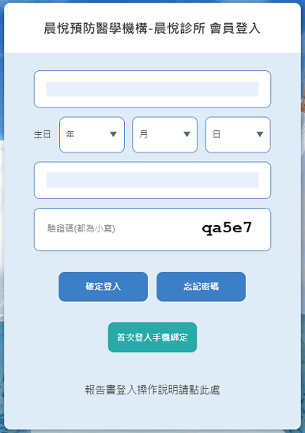
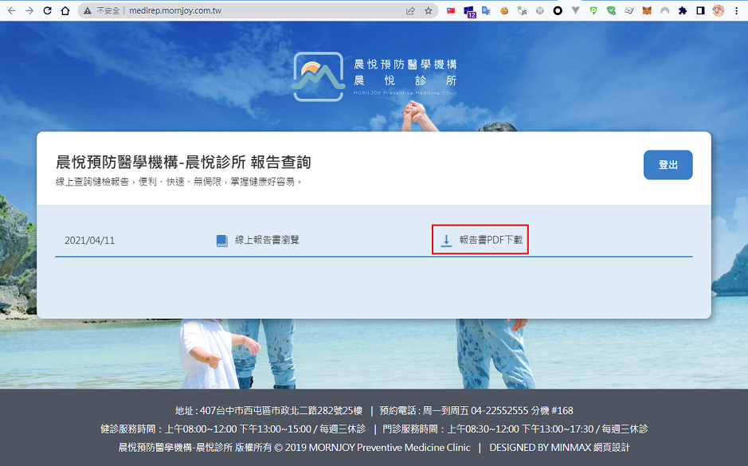
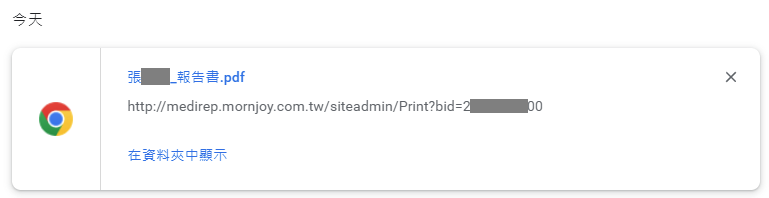
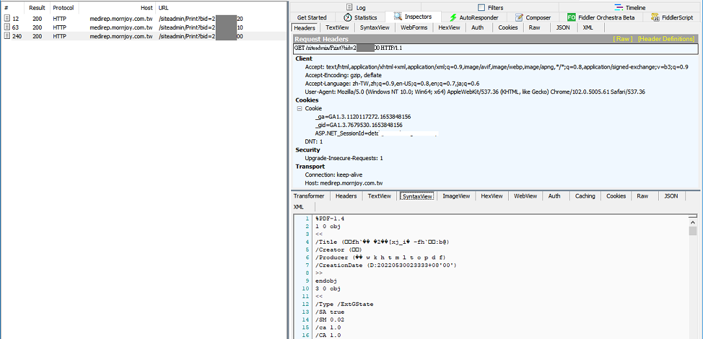
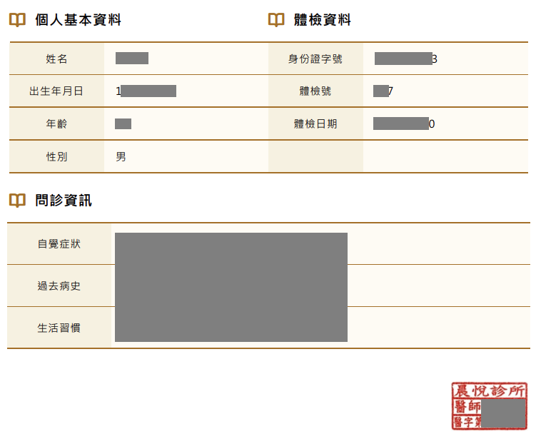

做完健康檢查後，在網站上登入後查看報告時，發現有個報告書下載的功能



下載完成後是一個PDF檔，這時發現下載網址後有個 `bid` 的參數



看起來 `bid` 的參數是有規律且有序的，此時嘗試修改不同的數值嘗試發起 request，發現可以正常取得PDF報告書



此存取控制缺陷的漏洞會造成可以取得他人的健檢報告資料




相關網址
```
https://medirep.mornjoy.com.tw/Login/Index
http://medirep.mornjoy.com.tw/siteadmin/Print?bid="_{Id}_"
```

回報於 [HITCON ZeroDay：晨悅預防醫學機構 醫療資料存取漏洞](https://zeroday.hitcon.org/vulnerability/ZD-2022-00376)

時間軸
> 2022/05/30 - 提交漏洞  
> 2022/06/02 - 通報未回應 (由 HITCON ZeroDay 服務團隊)  
> 2022/06/07 - 複測已修復 (by Leo)  
> 2022/07/30 - 公開


---

Reference
> [Access control vulnerabilities and privilege escalation | Web Security Academy](https://portswigger.net/web-security/access-control)
