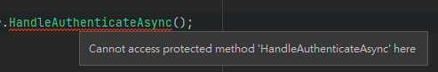

### 情境

在寫單元測試時，如果想要針對一個 protected method 做測試時，在測試專案想要存取 method 時會顯示 ```cannot access protected method 'XXX' here```



一般情況下最好是由呼叫 ```Protected``` 的 ```Public``` method 去做測試，但如果萬不得已，也有可以對 protected method 進行測試的方法。

### Testing Protected Methods

假設有個 protected method ```MyMethodName```，我們想要對這個 method 進行單元測試。

```C#
public class OriginalClass
{
    protected override string MyMethodName(){
        return "any string";
    }
}
```

這時可以在測試專案新增一個 ```FakeClass``` 去繼承 ```OriginalClass```，並新增一個 method，透過 new 修飾詞隱藏繼承自基底類別的方法，FakeClass 中 method 的實作使用 base 呼叫基底類別原有的方法。

```C#
public class FakeClass : OriginalClass
{
    public new string MyMethodName()
    {
        return base.MyMethodName();
    }
}
```

最後測試時使用 ```FakeClass``` 呼叫 ```MyMethodName``` 進行測試即可。

---

### Reference
> [了解使用 Override 和 New 關鍵字的時機](https://learn.microsoft.com/zh-tw/dotnet/csharp/programming-guide/classes-and-structs/knowing-when-to-use-override-and-new-keywords)  
> [new 修飾詞 (C# 參考)](https://learn.microsoft.com/zh-tw/dotnet/csharp/language-reference/keywords/new-modifier)