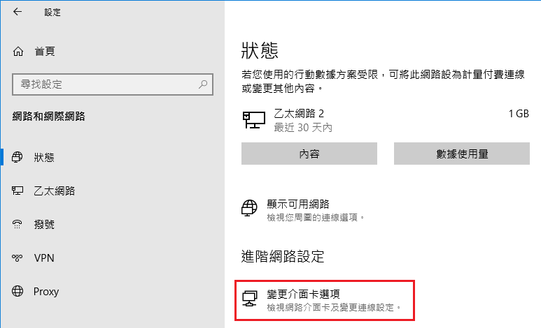
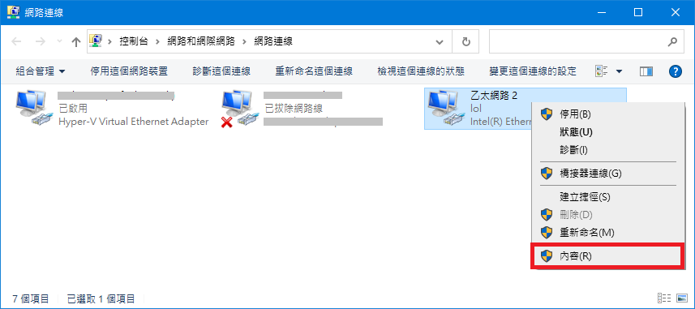
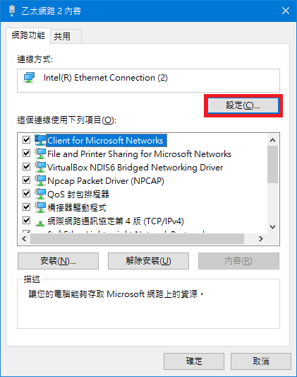
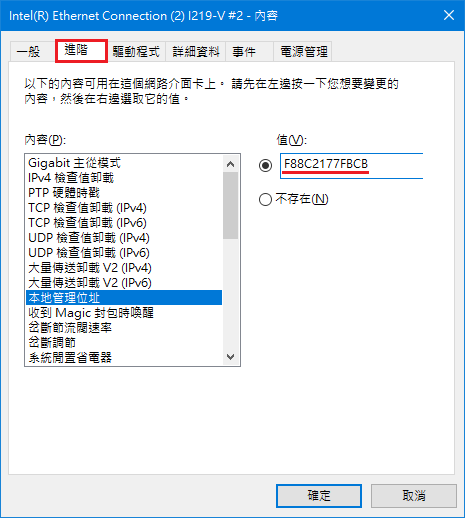

1. Windows 設定 > 網路和網際網路 > 狀態，點選 "變更介面卡選項"



2. 找到要修改的網路，右鍵 > 內容




3. 點選設定



4. 進階 > 本地管理位置 > 值，修改成指定的 MAC address 即可
    * 例如 ```F8:8C:21:77:FB:CB``` 則填入 ```F88C2177FBCB```



最後再利用指令檢查是否修改完成 (實體位址)
```powershell
ipconfig /all
```
